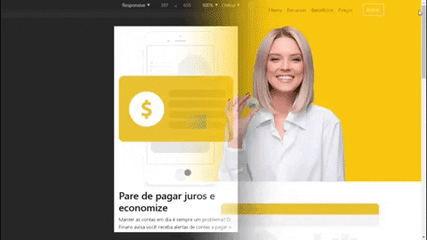
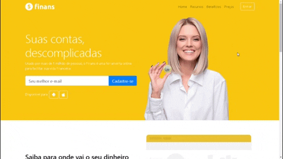

# Projeto Finans 
Esse é meu primeiro projeto utilizando Bootstrap 4, ele se trata de uma página responsiva para um produto fictício que auxília o usuário em sua vida financeira :dollar: 
Eu gostei muito de ter desenvolvido esse projeto, e também gostei muito do resultado final, consegui aprender muito sobre Responsividade e consegui ver na pratica como Bootstrap funciona!

This is my first project using Bootstrap 4, it's a responsive page for a fictional product that helps its users in their financial lives :dollar: 
I really enjoyed developing this site and I also liked the final result, I've learned a lot about responsive pages and I could see how Boostrap actually works!

## Resultado final / Final result :clipboard:

Você pode ver o resultado final desse projeto no ar clicando aqui: https://tiagodiass.github.io/projeto_finans 
E você também pode ver um preview de como ele ficou nos GIFs logo abaixo :arrow_down: 

You can see the final result of this project clicking here: https://tiagodiass.github.io/projeto_finans 
And you can also take a look at that seeing the GIFs below :arrow_down: 

### Mobile :iphone:

### Desktop :computer:

